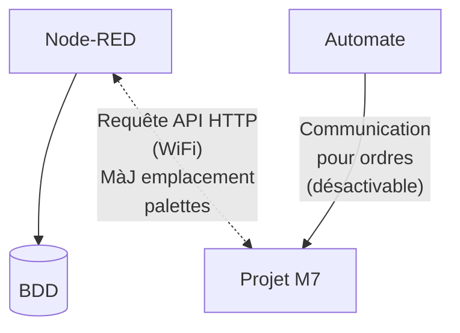

# M7-Lecteur-RFID
Ce dépôt contient l'ensemble des éléments du projet « Prototype de lecteur RFID » développé dans le cadre du module M7.    
L'objectif principal est de concevoir un système embarqué compact et bon marché, destiné à être dupliqué au sein des cellules de production des locaux de la NewTec.    
   
Ce système agit comme une interface physique et logique entre des tags RFID et un automate (PLC).   

## Détails du projet 

### Architecture Globale et Communication
Le lecteur utilise une architecture de communication hybride pour s'adapter aux différents besoins de la ligne de production :

- Communication Automate (PLC) : Le système est universel et s'intègre avec tout type de contrôleur (Wago, Beckhoff, Raspberry Pi, etc.). Cette communication, servant à transmettre les ordres et les données lues, peut être activée ou désactivée selon les besoins de la cellule.

- Communication API (Wi-Fi) : De manière indépendante, le système interagit avec un serveur Node-RED via des requêtes API HTTP pour mettre à jour l'emplacement des palettes en temps réel dans une base de données. 

### Spécifications Matérielles
Le dispositif est conçu pour fonctionner de manière autonome dans un environnement industriel.

- Microcontrôleur : Choix libre.
- Module RFID : SBC-RFID-RC522.
- Connectivité : Wi-Fi avec antenne (choix libre).
- Alimentation : 24V DC (standard industriel).
- Cibles RFID : Petits disques de 15 mm x 3 mm disposant d'une capacité de stockage maximale de 106 octets.
- Intégration mécanique : Boîtier de protection imprimé en 3D. Il assure la sécurité du PCB et de l'antenne, tout en proposant un design universel pour une fixation rapide sur n'importe quelle structure machine sans gêner le flux des palettes.

### Spécifications Logicielles
Le firmware embarqué gère à la fois l'antenne RFID et la communication avec l'automate.  

#### Librairie RFID
Une bibliothèque logicielle est intégrée pour gérer la mémoire restreinte des tags avec les fonctions suivantes :

| Fonction | Description | 
| --- | --- |
| READ | Lecture des données présentes. |
| WRITE | Écriture avec écrasement du contenu existant. |
| APPEND | Ajout de nouvelles données à la suite (via gestion de pointeurs/marqueurs). |
| DELETE ALL | Effacement complet ou formatage du tag. |

#### Logique de Contrôle

| Fonction | Description | 
| --- | --- |
| Démarrage/Arrêt | Piloté sur commande du PLC. |
| Badge lu avec succès | Retour du contenu formaté au PLC et envoi de la mise à jour de position au serveur Node-RED. |
| Badge illisible/Erreur | Retour d'un code d'erreur spécifique au PLC. |
| Badge défectueux | Retour d'un code d'erreur critique (HS) au PLC. |
| Aucun badge | État d'attente, aucune action. |

### Ressources utilisées
#### Logiciels
| Logo | Application | Version | Utilité | Licence |
| :---: | :--- | :--- | :--- | --- |
|  | [**OnlyOffice**](https://www.onlyoffice.com) | 9.3.1 | Suite bureautique utilisée pour la rédaction et l’édition des documents du projet (DOCX, XLSX). | AGPL-3.0 |
|  | [**Draw.io**](https://github.com/jgraph/drawio) | 29.3.6 | Outil de conception de diagrammes. Utilisé pour la conception UML. | Apache 2.0 |
|  | [**VSCodium**](https://vscodium.com/) | v1.116.02821 | Editeur de texte avec extension (IDE) | MIT |

#### Extensions IDE
| Logo | Extension | Version | Utilité | Licence |
| :---: | :--- | :--- | :--- | --- |
|  | PlatformIO | 3.3.4-codium | IDE pour l'ESP32 avec framework arduino (C++) | Apache-2.0 license |

### Modèle de Données et Optimisation
La contrainte matérielle majeure est la limite de 106 octets par tag. Une optimisation des données est indispensable.

#### Données des Palettes
- Identifiant de la palette.  
- Contenu de la palette : Jusqu'à 6 articles stockés sous le format `TTT-XXXXXX-VV-R` (Type de l'article, Code unique, Version, Révision).

#### Données des Badges Client :
- Identifiant de la palette.  
- Pseudonyme du client (10 caractères).  
- Données de production pour 4 cellules : Date, heure, et identifiant de la cellule ayant effectué l'opération.

## Livrables Attendus
L'arborescence de ce projet est divisée selon les livrables suivants :  

| Livrables | Description | 
| --- | --- |
| [Hardware](./Hardware/) | Dossier électronique contenant les schémas de principe, le routage PCB (fichiers Gerber) et la nomenclature (BOM). |
| [Mechanical](./Firmware/) | Fichiers 3D (STL/STEP) pour l'impression du boîtier de protection. |
| [Firmware](./Firmware/) | Code source documenté du microcontrôleur, incluant la pile de communication et la librairie RFID. |
| [Documents](./Documents/) | CdC et Journal, Documentation technique du projet (Table de communication décrivant le protocole PLC, les endpoints de l'API HTTP, et la cartographie d'optimisation mémoire) |
| [Images](./Images/) | Dossier contenant des images utilisés dans le projet. |